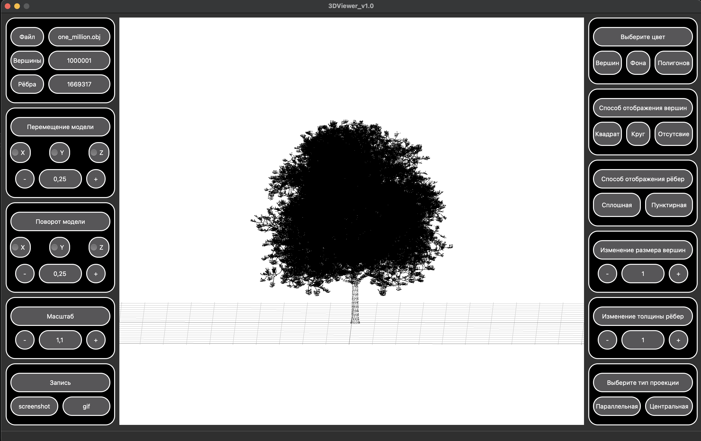
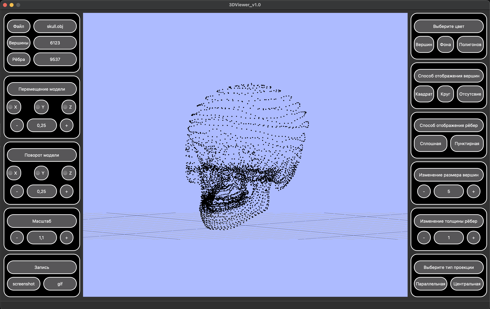
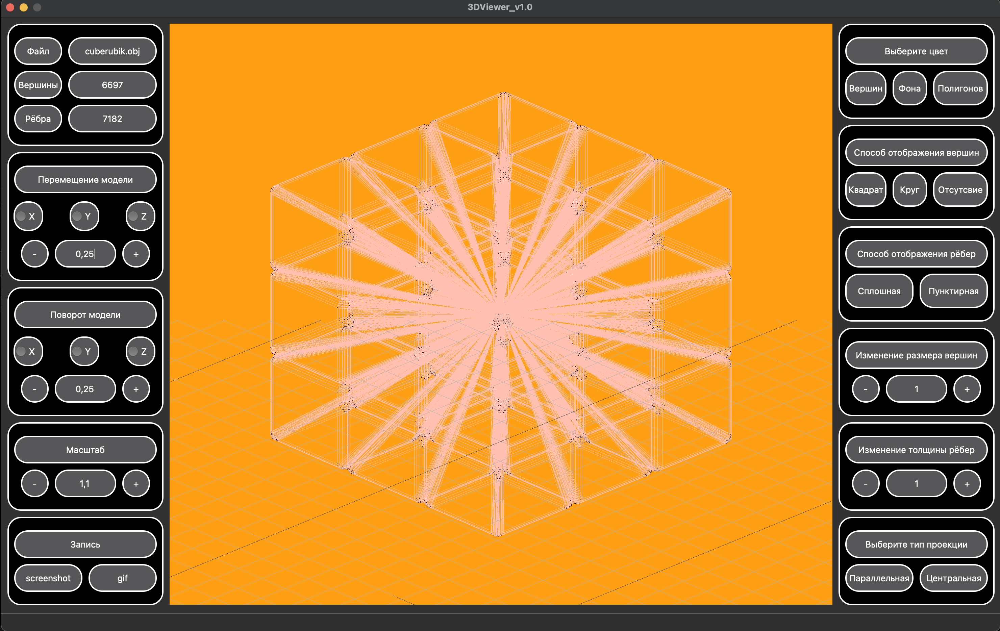

# 3DViewer

Example of using

---
3DViewer is a program for viewing 3D models in wireframe form.

### Installation 
To install __3DViewer__, you need to call the command:
> make install

3DViewer will be downloaded to the desktop in the folder "__3DViewer__".

### Delete
To delete 3DViewer, you need to call the command:
> make unistall

### Archiving
To archive the "3DViewer" project, you need to call the command:
> make dist

### Coverage
To view the test coverage of the program, you need to call the command:
> make gcov_report

---
## 3DViewer functionality:
### Initial introduction to 3DViewer
    After installing 3DViewer on the desktop, run s21_3DViewer.app in the "3DViewer" folder.
    The main menu opens, where:
- The main field in which the wireframe model of your obj file will be displayed;
    - In the left part of the window, there are:
1. Information about the file (file name, number of vertices and polygons in the displayed obj file);
      2. Functionality for moving the model along the X, Y, Z axes;
      3. Functionality for rotating the model along the X, Y, Z axes;
      4. Functionality for scaling the model.
    - In the right part of the window, there are buttons:
      1. Functionality for changing the background color, vertices and polygons;
      2. Functionality for changing the way vertices are displayed;
      3. Functionality for changing the way edges are displayed;
      4. Functionality for resizing vertices;
      5. Functionality for changing the thickness of the ribs.

### Adding an obj file
    To add and display your obj file in the menu bar (upper left corner), click on "Open model file", then "Select a file from the catalog". 
    Select the desired obj file, after that the application will display a wireframe model of the file.

### Moving the model
    To move the model in the cordinate system, use the functionality from the left side of the window.
    - Set the value by which you want to move, rotate, or scale the model;
    - Click on the "+" or "-" button.

### Changing the projection type
    You can change the projection type in the program:
- parallel (by default);
    - central.

### Color change
    You can change the background color, vertices, and polygons in the program.

### Changing the way vertices are displayed
    You can change the way the vertices are displayed in the program:
    - Square;
    - Circle;
    - Do not display vertices.

### Changing the way edges are displayed
    You can choose the way edges are displayed in the program:
    - Solid;
    - Dotted line.

### Resizing vertices
    You can change the size of the vertices in the program.

### Changing the thickness of the ribs
    You can change the thickness of the edges in the program.

### Saving and loading configuration settings
    In the program, you can save the settings set by the user, for this in the menu-bar (upper left corner) 
    select "Settings" and "Save settings" in it. To download them, click on the "Download settings" button in the same menu bar.

### Saving the model image in bmp and jpeg formats
    The program can save the image of the model in bmp or jpeg formats.

### Creating and saving gif animations of a model
    GIF animations can be saved in the program.